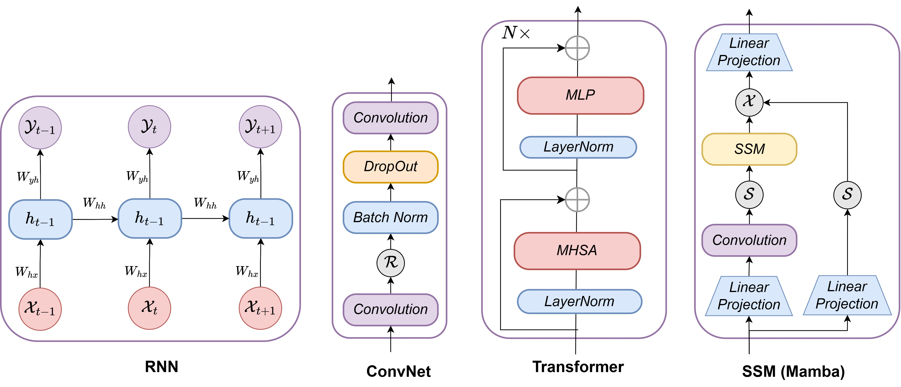

# Mamba-360: Survey of State Space Models as Transformer Alternative for Long Sequence Modelling: Methods, Applications, and Challenges
The Mamba-360 framework is a collection of State Space Models in various Domains.

## Abstract

'''
Sequence modeling is a crucial area across various domains, including Natural Language Processing (NLP), speech recognition, time series forecasting, music generation, and bioinformatics. Recurrent Neural Networks (RNNs) and Long Short Term Memory Networks (LSTMs)  have historically dominated sequence modeling tasks like Machine Translation, Named Entity Recognition (NER), etc. However, the advancement of transformers has led to a shift in this paradigm, given their superior performance. Yet, transformers suffer from $O(N^2)$ attention complexity and challenges in handling inductive bias. Several variations have been proposed to address these issues which use spectral networks or convolutions and have performed well on a range of tasks. However, they still have difficulty in dealing with long sequences. State Space Models(SSMs) have emerged as promising alternatives for sequence modeling paradigms in this context, especially with the advent of S4 and its variants, such as S4nd, Hippo, Hyena, Diagnol State Spaces (DSS), Gated State Spaces (GSS), Linear Recurrent Unit (LRU), Liquid-S4, Mamba, etc. In this survey, we categorize the foundational SSMs based on three paradigms namely, Gating architectures, Structural architectures, and Recurrent architectures. This survey also highlights diverse applications of SSMs across domains such as vision, video, audio, speech, language (especially long sequence modeling), medical (including genomics), chemical (like drug design), recommendation systems, and time series analysis, including tabular data. Moreover, we consolidate the performance of SSMs on benchmark datasets like Long Range Arena (LRA), WikiText, Glue, Pile, ImageNet, Kinetics-400, sstv2, as well as video datasets such as Breakfast, COIN, LVU, and various time series datasets.
'''

## Adavance State Space Models
 

## SSMs for Various Applications
 

## Architectural Evolution
 

## Basic Of SSM.
 

## SSM SOTA on ImageNet-1K dataset with Image size 224 x 224.
This table shows the performance of various SSM models for Image Recognition tasks on the ImageNet1K dataset (Deng et al., 2009). 

Table: SSM SOTA on ImageNet-1K. This table shows the performance of various SSM models for Image Recognition tasks on the ImageNet1K dataset. Models are grouped into three categories based on their GFLOPs. This table is adapted from the original source.

| Method          | Image Size | \#Param. | FLOPs | Top-1 acc. |
|-----------------|------------|----------|-------|------------|
| HyenaViT-B      | 224^2      | 88M      | -     | 78.5       |
| S4ND-ViT-B      | 224^2      | 89M      | -     | 80.4       |
| TNN-T           | -          | 6.4M     | -     | 72.29      |
| TNN-S           | -          | 23.4M    | -     | 79.20      |
| Vim-Ti          | 224^2      | 7M       | -     | 76.1       |
| Vim-S           | 224^2      | 26M      | -     | 80.5       |
| HGRN-T          | -          | 6.1M     | -     | 74.40      |
| HGRN-S          | -          | 23.7M    | -     | 80.09      |
| PlainMamba-L1   | 224^2      | 7M       | 3.0G  | 77.9       |
| PlainMamba-L2   | 224^2      | 25M      | 8.1G  | 81.6       |
| PlainMamba-L3   | 224^2      | 50M      | 14.4G | 82.3       |
| Mamba-2D-S      | 224^2      | 24M      | -     | 81.7       |
| Mamba-2D-B      | 224^2      | 92M      | -     | 83.0       |
| VMamba-T        | 224^2      | 22M      | 5.6G  | 82.2       |
| VMamba-S        | 224^2      | 44M      | 11.2G | 83.5       |
| VMamba-B        | 224^2      | 75M      | 18.0G | 83.2       |
| LocalVMamba-T   | 224^2      | 26M      | 5.7G  | 82.7       |
| LocalVMamba-S   | 224^2      | 50M      | 11.4G | 83.7       |
| SiMBA-S(Monarch)| 224^2      | 18.5M    | 3.6G  | 81.1       |
| SiMBA-B(Monarch)| 224^2      | 26.9M    | 6.3G  | 82.6       |
| SiMBA-L(Monarch)| 224^2      | 42M      | 10.7G | 83.8       |
| ViM2-T          | 224^2      | 20M      | -     | 82.7       |
| ViM2-S          | 224^2      | 43M      | -     | 83.7       |
| ViM2-B          | 224^2      | 74M      | -     | 83.9       |
| SiMBA-S(EinFFT) | 224^2      | 15.3M    | 2.4G  | 81.7       |
| SiMBA-B(EinFFT) | 224^2      | 22.8M    | 5.2G  | 83.5       |
|**SiMBA-L(EinFFT)** | 224^2      | 36.6M    | 9.6G  | **84.4**       |
| **SiMBA-S(MLP)**    | 224^2      | 26.5M    | 5.0G  | **84.0**       |
| **SiMBA-B(MLP)**    | 224^2      | 40.0M    | 9.0G  | **84.7**       |

## State of the Art results of various vision models (Convnets, Transformers, SSMs) on ImageNet-1K dataset with Image size 224 x 224.

Table: SOTA on ImageNet-1K}The table shows the performance of various vision backbones on the ImageNet1K dataset for image recognition tasks.  $\star$ indicates additionally trained with the Token Labeling for patch encoding. We have grouped the vision models into three categories based on their GFLOPs (Small, Base, and Large). The GFLOP ranges: Small (GFLOPs$<$5), Base (5$\leq$GFLOPs$<$10), and Large (10$\leq$GFLOPs$<$30). This table is adapted from the SiMBA paper.
| Method                | Image Size | \#Param. | FLOPs | Top-1 acc. |
|-----------------------|------------|----------|-------|------------|
|                     **Convnets**                                   |
| ResNet-101            | $224^2$    | 45M      | -     | 77.4       |
| RegNetY-8G           | $224^2$    | 39M      | 8.0G  | 81.7       |
| ResNet-152            | $224^2$    | 60M      | -     | 78.3       |
| RegNetY-16G          | $224^2$    | 84M      | 16.0G | 82.9       |
| **Transformers**                 |
| DeiT-S                | $224^2$    | 22M      | 4.6G  | 79.8       |
| Swin-T                | $224^2$    | 29M      | 4.5G  | 81.3       |
| EffNet-B4             | $380^2$    | 19M      | 4.2G  | 82.9       |
| WaveViT-H-S$^\star$   | $224^2$    | 22.7M    | 4.1G  | 82.9       |
| SpectFormer-H-S$^\star$| $224^2$   | 22.2M    | 3.9G  | 84.3       |
| SVT-H-S$^\star$       | $224^2$    | 22M      | 3.9G  | 84.2       |
| SCT-H-S$^\star$       | $224^2$    | 21.7M    | 4.1G  | 84.5       |
| EffNet-B5             | $456^2$    | 30M      | 9.9G  | 83.6       |
| Swin-S                | $224^2$    | 50M      | 8.7G  | 83.0       |
| CMT-B                 | $224^2$    | 45M      | 9.3G  | 84.5       |
| MaxViT-S              | $224^2$    | 69M      | 11.7G | 84.5       |
| iFormer-B             | $224^2$    | 48M      | 9.4G  | 84.6       |
| Wave-ViT-B$^\star$    | $224^2$    | 33M      | 7.2G  | 84.8       |
| SpectFormer-H-B$^\star$| $224^2$   | 33.1M    | 6.3G  | 85.1       |
| SVT-H-B$^\star$       | $224^2$    | 32.8M    | 6.3G  | 85.2       |
| SCT-H-B$^\star$       | $224^2$    | 32.5M    | 6.5G  | 85.2       |
| M2-ViT-b              | $224^2$    | 45M      | -     | 79.5       |
| DeiT-B                | $224^2$    | 86M      | 17.5G | 81.8       |
| Swin-B                | $224^2$    | 88M      | 15.4G | 83.5       |
| M2-Swin-B             | $224^2$    | 50M      | -     | 83.5       |
| EffNet-B6             | $528^2$    | 43M      | 19.0G | 84.0       |
| MaxViT-B              | $224^2$    | 120M     | 23.4G | 85.0       |
| VOLO-D3$^\star$       | $224^2$    | 86M      | 20.6G | 85.4       |
| Wave-ViT-L$^\star$    | $224^2$    | 57M      | 14.8G | 85.5       |
| SpectFormer-H-L$^\star$| $224^2$   | 54.7M    | 12.7G | 85.7       |
| SVT-H-L$^\star$       | $224^2$    | 54.0M    | 12.7G | 85.7       |
| SCT-H-L$^\star$       | $224^2$    | 54.1M    | 13.4G | 85.9       |
| **SSMs**                     |
| Vim-Ti                | $224^2$    | 7M       | -     | 76.1       |
| PlainMamba-L1         | $224^2$    | 7M       | 3.0G  | 77.9       |
| VMamba-T              | $224^2$    | 22M      | 5.6G  | 82.2       |
| SiMBA-S(Monarch)      | $224^2$    | 18.5M    | 3.6G  | 81.1       |
| Mamba-2D-S            | $224^2$    | 24M      | -     | 81.7       |
| SiMBA-S(EinFFT)       | $224^2$    | 15.3M    | 2.4G  | 81.7       |
| LocalVMamba-T         | $224^2$    | 26M      | 5.7G  | 82.7       |
| ViM2-T                | $224^2$    | 20M      | -     | 82.7       |
| SiMBA-S(MLP)          | $224^2$    | 26.5M    | 5.0G  | 84.0       |
| Vim-S                 | $224^2$    | 26M      | -     | 80.5       |
| PlainMamba-L2         | $224^2$    | 25M      | 8.1G  | 81.6       |
| SiMBA-B(Monarch)      | $224^2$    | 26.9M    | 6.3G  | 82.6       |
| Mamba-2D-B            | $224^2$    | 92M      | -     | 83.0       |
| SiMBA-B(EinFFT)       | $224^2$    | 22.8M    | 5.2G  | 83.5       |
| VMamba-S              | $224^2$    | 44M      | 11.2G | 83.5       |
| LocalVMamba-S         | $224^2$    | 50M      | 11.4G | 83.7       |
| ViM2-S                | $224^2$    | 43M      | -     | 83.7       |
| SiMBA-B(MLP)          | $224^2$    | 40.0M    | 9.0G  | 84.7       |
| HyenaViT-B            | $224^2$    | 88M      | -     | 78.5       |
| S4ND-ViT-B            | $224^2$    | 89M      | -     | 80.4       |
| PlainMamba-L3         | $224^2$    | 50M      | 14.4G | 82.3       |
| VMamba-B              | $224^2$    | 75M      | 18.0G | 83.2       |
| SiMBA-L(Monarch)      | $224^2$    | 42M      | 10.7G | 83.8       |
| ViM2-B                | $224^2$    | 74M      | -     | 83.9       |
| SiMBA-L(EinFFT)       | $224^2$    | 36.6M    | 9.6G  | 84.4       |

## State of the Art results of LRA benchmark tasks (Tay et al., 2020).
Table: Test accuracy on the LRA benchmark tasks (Tay et al., 2020). "✗" indicates the model did not exceed random guessing.  The results for models ranging from Transformer to Performer are sourced from Tay et al. (2020). We compiled this table using data from the HGRN paper by Qin et al. (2023) and the S5 paper by Smith et al. (2022), consolidating the results into a unified presentation below.
| Model               | ListOps | Text  | Retrieval | Image | Pathfinder | Path-X | Avg.  |
|---------------------|---------|-------|-----------|-------|------------|--------|-------|
| Transformer         | 36.37   | 64.27 | 57.46     | 42.44 | 71.40      | ✗      | 53.66 |
| Local Attention     | 15.82   | 52.98 | 53.39     | 41.46 | 66.63      | ✗      | 46.71 |
| Sparse Trans.       | 17.07   | 63.58 | 59.59     | 44.24 | 71.71      | ✗      | 51.03 |
| Longformer         | 35.63   | 62.85 | 56.89     | 42.22 | 69.71      | ✗      | 52.88 |
| Linformer          | 35.70   | 53.94 | 52.27     | 38.56 | 76.34      | ✗      | 51.14 |
| Reformer           | 37.27   | 56.10 | 53.40     | 38.07 | 68.50      | ✗      | 50.56 |
| Sinkhorn Trans.    | 33.67   | 61.20 | 53.83     | 41.23 | 67.45      | ✗      | 51.23 |
| Synthesizer        | 36.99   | 61.68 | 54.67     | 41.61 | 69.45      | ✗      | 52.40 |
| BigBird            | 36.05   | 64.02 | 59.29     | 40.83 | 74.87      | ✗      | 54.17 |
| Linear Trans.      | 16.13   | 65.90 | 53.09     | 42.34 | 75.30      | ✗      | 50.46 |
| Performer          | 18.01   | 65.40 | 53.82     | 42.77 | 77.05      | ✗      | 51.18 |
| cosFormer          | 36.50   | 67.70 | 83.15     | 51.23 | 71.96      | -      | 51.76 |
| FLASH              | 38.70   | 64.10 | 86.10     | 47.40 | 70.25      | -      | 51.09 |
| FNet               | 35.33   | 65.11 | 59.61     | 38.67 | 77.80      | ✗      | 54.42 |
| Nyströmformer      | 37.15   | 65.52 | 79.56     | 41.58 | 70.94      | ✗      | 57.46 |
| Luna-256           | 37.25   | 64.57 | 79.29     | 47.38 | 77.72      | ✗      | 59.37 |
| H-Transformer-1D   | 49.53   | 78.69 | 63.99     | 46.05 | 68.78      | ✗      | 61.41 |
| CCNN               | 43.60   | 84.08 | ✗         | 88.90 | 91.51      | ✗      | 68.02 |
| S4                 | 58.35   | 76.02 | 87.09     | 87.26 | 86.05      | 88.10  | 80.48 |
| DSSEXP             | 59.70   | 84.60 | 87.60     | 84.90 | 84.70      | 85.60  | 81.18 |
| DSS(SOFTMAX)       | 60.60   | 84.80 | 87.80     | 85.70 | 84.60      | 87.80  | 81.88 |
| S4D-LegS           | 60.47   | 86.18 | 89.46     | 88.19 | 93.06      | 91.95  | 84.89 |
| Mega-chunk         | 58.76   | 90.19 | 90.97     | 85.80 | 94.41      | 93.81  | 85.66 |
| S4-LegS            | 59.60   | 86.82 | 90.90     | 88.65 | 94.20      | 96.35  | 86.09 |
| TNN                | 61.04   | 87.90 | 90.97     | 88.24 | 93.00      | 96.10  | 86.21 |
| LRU                | 60.20   | 89.40 | 89.90     | 89.00 | 95.10      | 94.20  | 86.30 |
| HGRN               | 59.95   | 88.14 | 94.23     | 88.69 | 92.92      | 97.50  | 86.91 |
| SGConv             | 61.45   | 89.2  | 91.11     | 87.97 | 95.46      | 97.83  | 87.17 |
| Liquid-S4          | 62.75   | 89.02 | 91.20     | 89.50 | 94.8       | 96.66  | 87.32 |
| S5                 | 62.15   | 89.31 | 91.40     | 88.00 | 95.33      | **98.58**  | 87.46 |
| **Mega**               | 63.14   | 90.43 | 91.25     | 90.44 | 96.01      | 97.98  | **88.21** |

##  Multivariate Time series benchmark Datasets

It uses prediction lengths  \(T \in \{96, 192, 336, 720\}\) for all the datasets for lookup window 96. The best results are in **bold** and the second best is <ins>underlined</ins>.

| Models | Metric | Simba | TimesNet | Crossformer | PatchTST | ETSFormer | DLinear | FEDFormer | Autoformer | Pyraformer | MTGNN |
|--------|--------|-------|----------|-------------|----------|-----------|---------|-----------|------------|------------|-------|
| ETTm1  | 96     | **0.324** | **0.360** | <ins>0.338</ins> | <ins>0.375</ins> | 0.349     | 0.395   | 0.339     | 0.377      | 0.475      | 0.543 |
|        | 192    | **0.363** | **0.382** | <ins>0.374</ins> | <ins>0.387</ins> | 0.405     | 0.411   | 0.376     | 0.392      | 0.557      | 0.537 |
|        | 336    | **0.395** | **0.405** | 0.410         | <ins>0.411</ins> | 0.432     | 0.431   | <ins>0.408</ins> | 0.417      | 0.754      | 0.655 |
|        | 720    | **0.451** | **0.437** | <ins>0.478</ins> | <ins>0.450</ins> | 0.487     | 0.463   | 0.499     | 0.461      | 0.908      | 0.724 |
| ETTm2  | 96     | **0.177** | **0.263** | <ins>0.187</ins> | <ins>0.267</ins> | 0.208     | 0.292   | 0.192     | 0.273      | 0.507      | 0.299 |
|        | 192    | **0.245** | **0.306** | <ins>0.249</ins> | <ins>0.309</ins> | 0.263     | 0.332   | 0.252     | 0.314      | 0.673      | 0.328 |
|        | 336    | **0.304** | **0.343** | 0.321         | <ins>0.351</ins> | 0.337     | 0.369   | <ins>0.318</ins> | 0.357      | 1.201      | 0.374 |
|        | 720    | **0.400** | **0.399** | <ins>0.408</ins> | <ins>0.403</ins> | 0.429     | 0.430   | 0.413     | 0.416      | 3.625      | 0.459 |

  
**Table:** Multivariate long-term forecasting results: It uses prediction lengths \(T \in \{96, 192, 336, 720\}\) for all the datasets for lookup window 96. The best results are in **bold** and the second best is <ins>underlined</ins>. This table is adapted from the SiMBA paper [@patro2024simba].

|              |Models | Simba |       | TimesNet |       | Crossformer |       | PatchTST |        | ETSFormer |        | DLinear |        | FEDFormer |        | Autoformer |        | Pyraformer |        | MTGNN |
|              |  Metric |  MSE   | MAE   | MSE   | MAE   | MSE   | MAE   | MSE   | MAE   | MSE   | MAE   | MSE   | MAE   | MSE   | MAE   | MSE   | MAE   | MSE   | MAE   | MSE   | MAE   |
|--------------|--------|-------|-------|-------|-------|-------|-------|-------|-------|-------|-------|-------|-------|-------|-------|-------|-------|-------|-------|-------|-------|
| ETTm1        | 96     | **0.324** | **0.360** | 0.338 | 0.375 | 0.349 | 0.395 | 0.339 | 0.377 | 0.375 | 0.398 | 0.345 | 0.372 | 0.379 | 0.419 | 0.505 | 0.475 | 0.543 | 0.510 | 0.379 | 0.446 |
|              | 192    | **0.363** | **0.382** | 0.374 | 0.387 | 0.405 | 0.411 | 0.376 | 0.392 | 0.408 | 0.410 | 0.380 | 0.389 | 0.426 | 0.441 | 0.553 | 0.496 | 0.557 | 0.537 | 0.470 | 0.428 |
|              | 336    | **0.395** | **0.405** | 0.410 | 0.411 | 0.432 | 0.431 | 0.408 | 0.417 | 0.435 | 0.428 | 0.413 | 0.413 | 0.445 | 0.459 | 0.621 | 0.537 | 0.754 | 0.655 | 0.473 | 0.430 |
|              | 720    | **0.451** | **0.437** | 0.478 | 0.450 | 0.487 | 0.463 | 0.499 | 0.461 | 0.499 | 0.462 | 0.474 | 0.453 | 0.543 | 0.490 | 0.671 | 0.561 | 0.908 | 0.724 | 0.553 | 0.479 |
| ETTm2        | 96     | **0.177** | **0.263** | 0.187 | 0.267 | 0.208 | 0.292 | 0.192 | 0.273 | 0.189 | 0.280 | 0.193 | 0.292 | 0.203 | 0.287 | 0.255 | 0.339 | 0.435 | 0.507 | 0.203 | 0.299 |
|              | 192    | **0.245** | **0.306** | 0.249 | 0.309 | 0.263 | 0.332 | 0.252 | 0.314 | 0.253 | 0.319 | 0.284 | 0.362 | 0.269 | 0.328 | 0.281 | 0.340 | 0.730 | 0.673 | 0.265 | 0.328 |
|              | 336    | **0.304** | **0.343** | 0.321 | 0.351 | 0.337 | 0.369 | 0.318 | 0.357 | 0.314 | 0.357 | 0.369 | 0.427 | 0.325 | 0.366 | 0.339 | 0.372 | 1.201 | 0.845 | 0.365 | 0.374 |
|              | 720    | **0.400** | **0.399** | 0.408 | 0.403 | 0.429 | 0.430 | 0.413 | 0.416 | 0.414 | 0.413 | 0.554 | 0.522 | 0.421 | 0.415 | 0.433 | 0.432 | 3.625 | 1.451 | 0.461 | 0.459 |
| ETTh1        | 96     | **0.379** | **0.395** | 0.384 | 0.402 | 0.384 | 0.428 | 0.385 | 0.408 | 0.494 | 0.479 | 0.386 | 0.400 | 0.376 | 0.419 | 0.449 | 0.459 | 0.664 | 0.612 | 0.515 | 0.517 |
|              | 192    | 0.432 | **0.424** | 0.436 | 0.429 | 0.438 | 0.452 | **0.431** | **0.432** | 0.538 | 0.504 | 0.437 | 0.432 | 0.420 | 0.448 | 0.500 | 0.482 | 0.790 | 0.681 | 0.553 | 0.522 |
|              | 336    | **0.473** | **0.443** | 0.491 | 0.469 | 0.495 | 0.483 | **0.485** | **0.462** | 0.574 | 0.521 | 0.481 | 0.459 | 0.459 | 0.465 | 0.521 | 0.496 | 0.891 | 0.738 | 0.612 | 0.577 |
|              | 720    |**0.483** | **0.469** | 0.521 | 0.500 | 0.522 | 0.501 | **0.497** | **0.483** | 0.562 | 0.535 | 0.519 | 0.516 | 0.506 | 0.507 | 0.514 | 0.512 | 0.963 | 0.782 | 0.609 | 0.597 |
| ETTh2        | 96     |**0.290** | **0.339** | 0.340 | 0.374 | 0.347 | 0.391 | 0.343 | 0.376 | 0.340 | 0.391 | 0.333 | 0.387 | 0.358 | 0.397 | 0.346 | 0.388 | 0.645 | 0.597 | 0.354 | 0.454 |
|              | 192    |**0.373** | **0.390** | 0.402 | 0.414 | 0.419 | 0.427 | 0.405 | 0.417 | 0.430 | 0.439 | 0.477 | 0.476 | 0.429 | 0.439 | 0.456 | 0.452 | 0.788 | 0.683 | 0.457 | 0.464 |
|              | 336    |**0.376** | **0.406** | 0.452 | 0.452 | 0.449 | 0.465 | **0.448** | **0.453** | 0.485 | 0.479 | 0.594 | 0.541 | 0.496 | 0.487 | 0.482 | 0.486 | 0.907 | 0.747 | 0.515 | 0.540 |
|              | 720    |**0.407** | **0.431** | 0.462 | 0.468 | 0.479 | 0.505 | 0.464 | **0.483** | 0.500 | 0.497 | 0.831 | 0.657 | 0.463 | 0.474 | 0.515 | 0.511 | 0.963 | 0.783 | 0.532 | 0.576 |
| Electricity  | 96     | 0.165 | **0.253** | 0.168 | 0.272 | 0.185 | 0.288 | **0.159** | 0.268 | 0.187 | 0.304 | 0.197 | 0.282 | 0.193 | 0.308 | 0.201 | 0.317 | 0.386 | 0.449 | 0.217 | 0.318 |
|              | 192    | **0.173** | **0.262** | 0.198 | 0.300 | 0.211 | 0.312 | 0.195 | **0.296** | 0.212 | 0.329 | 0.209 | 0.301 | 0.214 | 0.329 | 0.231 | 0.338 | 0.376 | 0.443 | 0.260 | 0.348 |
|              | 336    |**0.188** | **0.277** | 0.198 | 0.300 | 0.211 | 0.312 | 0.195 | **0.296** | 0.212 | 0.329 | 0.209 | 0.301 | 0.214 | 0.329 | 0.231 | 0.338 | 0.376 | 0.443 | 0.260 | 0.348 |
|              | 720    | **0.214** | **0.305** | 0.220 | 0.320 | 0.223 | 0.335 | **0.215** | **0.317** | 0.233 | 0.345 | 0.245 | 0.333 | 0.246 | 0.355 | 0.254 | 0.361 | 0.376 | 0.445 | 0.290 | 0.369 |
| Traffic      | 96     |**0.468** | **0.268** | 0.593 | 0.321 | 0.591 | 0.329 | **0.583** | **0.319** | 0.607 | 0.392 | 0.650 | 0.396 | 0.587 | 0.366 | 0.613 | 0.388 | 0.867 | 0.468 | 0.660 | 0.437 |
|              | 192    | **0.413** | **0.317** | 0.617 | 0.336 | 0.607 | 0.345 | **0.591** | **0.331** | 0.621 | 0.399 | 0.598 | 0.370 | 0.604 | 0.373 | 0.616 | 0.382 | 0.869 | 0.467 | 0.649 | 0.438 |
|              | 336    |**0.529** | **0.284** | 0.629 | 0.336 | 0.613 | 0.339 | **0.599** | **0.332** | 0.622 | 0.396 | 0.605 | 0.373 | 0.621 | 0.383 | 0.622 | 0.337 | 0.881 | 0.469 | 0.653 | 0.472 |
|              | 720    |**0.564** | **0.297** | 0.640 | 0.350 | 0.620 | 0.348 | **0.601** | **0.341** | 0.632 | 0.396 | 0.645 | 0.394 | 0.626 | 0.382 | 0.660 | 0.408 | 0.896 | 0.473 | 0.639 | 0.437 |
| Weather      | 96     | 0.176 | **0.219** | 0.172 | 0.220 | 0.191 | 0.251 | **0.171** | 0.230 | 0.197 | 0.281 | 0.196 | 0.255 | 0.217 | 0.296 | 0.266 | 0.336 | 0.622 | 0.556 | 0.230 | 0.329 |
|              | 192    | 0.222 | **0.260** | **0.219** |0.261 | 0.219 | 0.279 | 0.219 | **0.271** | 0.237 | 0.312 | 0.237 | 0.296 | 0.276 | 0.336 | 0.307 | 0.367 | 0.739 | 0.624 | 0.263 | 0.322 |
|              | 336    |**0.275** | **0.297** | 0.280 | 0.306 | 0.287 | 0.332 | 0.277 | **0.321** | 0.298 | 0.353 | 0.283 | 0.335 | 0.339 | 0.380 | 0.359 | 0.395 | 1.004 | 0.753 | 0.354 | 0.396 |
|              | 720    |**0.350** | **0.349** | 0.365 | 0.359 | 0.368 | 0.378 | 0.365 | **0.367** | 0.352 | 0.288 | 0.345 | 0.381 | 0.403 | 0.428 | 0.419 | 0.428 | 1.420 | 0.934 | 0.409 | 0.371 |

##  Comparison with SoTA methods on 8 benchmark datasets for Multimodal Applications

Benchmark names are abbreviated due to space limits. VQA-v2 (Goyal et al., 2017); GQA (Hudson and Manning, 2019); SQA-I: ScienceQA-IMG (Anonymous, 2022); VQA-T: TextVQA (Singh et al., 2019); POPE (Li et al., 2023); MME (Yin et al., 2023); MMB: MMBench (Liu et al., 2023); MM-Vet (Yu et al., 2023). PT and IT indicate the number of samples in the pretraining and instruction tuning stages, respectively.

Table: Comparison with State-of-the-Art (SoTA) methods on 8 benchmarks. Benchmark names are abbreviated for space considerations. PT and IT indicate the number of samples in the pretraining and instruction tuning stages, respectively. This table is adapted from the VL-Mamba paper (Qiao et al., 2024).
| Method         | LLM           | PT     | IT     | VQA-v2 | GQA   | SQA-I | VQA-T | POPE  | MME    | MMB   | MM-Vet |
|----------------|---------------|--------|--------|--------|-------|-------|-------|-------|--------|-------|--------|
| BLIP-2         | Vicuna-13B    | 129M   | -      | 41.0   | 41.0  | 61.0  | 42.5  | 85.3  | 1293.8 | --    | 22.4   |
| MiniGPT-4      | Vicuna-7B     | 5M     | 5K     | -      | 32.2  | -     | -     | -     | 581.7  | 23.0  | -      |
| InstructBLIP   | Vicuna-7B     | 129M   | 1.2M   | --     | 49.2  | 60.5  | 50.1  | --    | --     | 36    | 26.2   |
| InstructBLIP   | Vicuna-13B    | 129M   | 1.2M   | --     | 49.5  | 63.1  | 50.7  | 78.9  | 1212.8 | --    | 25.6   |
| Shikra         | Vicuna-13B    | 600K   | 5.5M   | 77.4   | --    | --    | --    | --    | --     | 58.8  | --     |
| Otter          | LLaMA-7B      | -      | -      | -      | -     | -     | -     | -     | 1292.3 | 48.3  | 24.6   |
| mPLUG-Owl      | LLaMA-7B      | 2.1M   | 102K   | -      | -     | -     | -     | -     | 967.3  | 49.4  | -      |
| IDEFICS-9B     | LLaMA-7B      | 353M   | 1M     | 50.9   | 38.4  | --    | 25.9  | --    | --     | 48.2  | --     |
| IDEFICS-80B    | LLaMA-65B     | 353M   | 1M     | 60.0   | 45.2  | --    | 30.9  | --    | --     | 54.5  | --     |
| Qwen-VL        | Qwen-7B       | 1.4B   | 50M    | 78.8   | 59.3  | 67.1  | 63.8  | --    | --     | 38.2  | --     |
| Qwen-VL-Chat   | Qwen-7B       | 1.4B   | 50M    | 78.2   | 57.5  | 68.2  | 61.5  | --    | 1487.5 | 60.6  | --     |
| LLaVA-1.5      | Vicuna-7B     | 558K   | 665K   | 78.5   | 62.0  | 66.8  | 58.2  | 85.9  | 1510.7 | 64.3  | 30.5   |
| LLaVA-1.5      | Vicuna-13B    | 558K   | 665K   | 80.0   | 63.3  | 71.6  | 61.3  | 85.9  | 1531.3 | 67.7  | 35.4   |
| LLaVA-Phi      | Phi-2-2.7B    | 558K   | 665K   | 71.4   | -     | 68.4  | 48.6  | 85.0  | 1335.1 | 59.8  | 28.9   |
| MobileVLM-3B   | MobileLLaMA-2.7B | 558K | 665K | -      | 59.0  | 61.2  | 47.5  | 84.9  | 1288.9 | 59.6  | -      |
| Cobra          | Mamba-2.8B     | -      | -      | 75.9   | 58.5  | -     | 46.0  | 88.0  | -      | -     | -      |
| **VL-Mamba**       | Mamba LLM-2.8B| 558K   | 665K   | 76.6   | 56.2  | 65.4  | 48.9  | 84.4  | 1369.6 | 57.0  | 32.6   |

